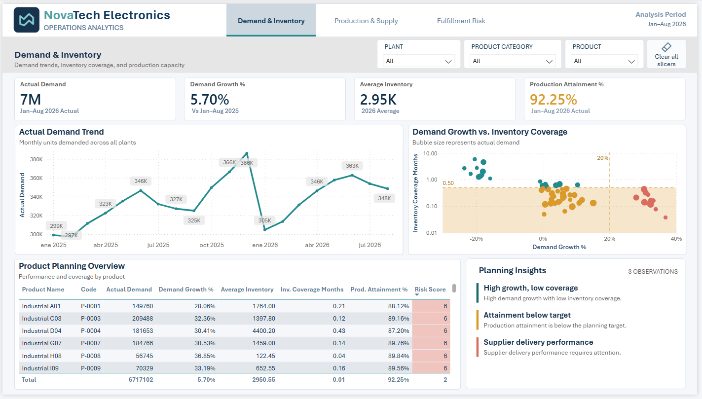
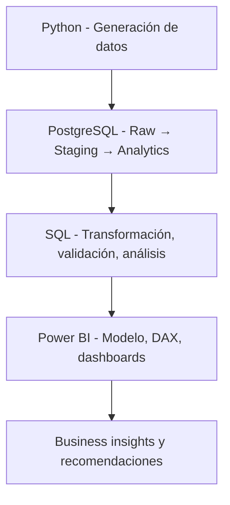
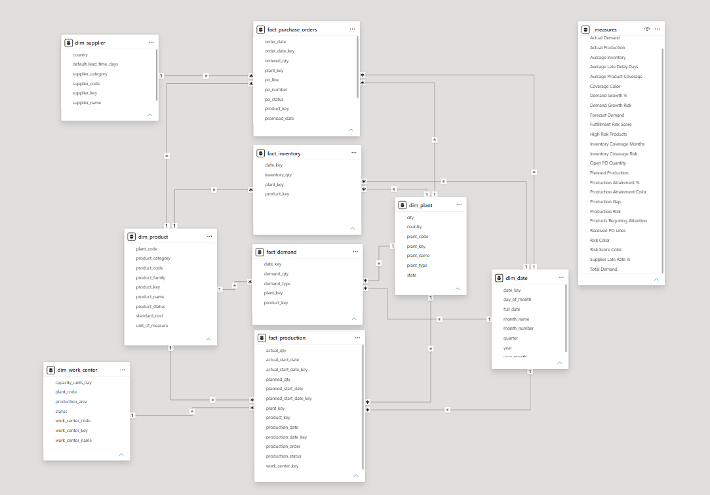
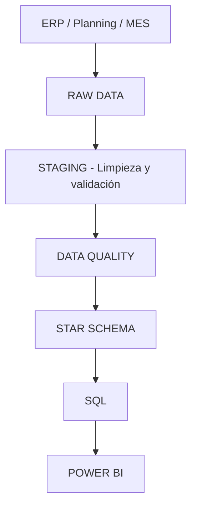
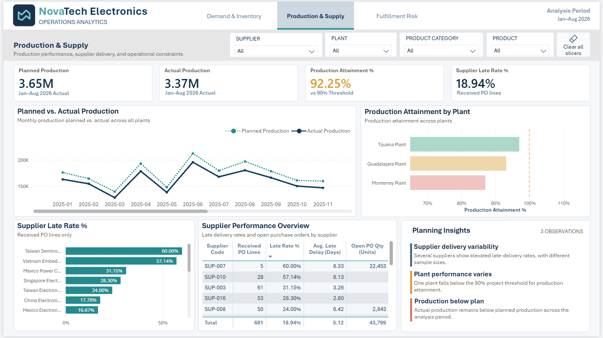
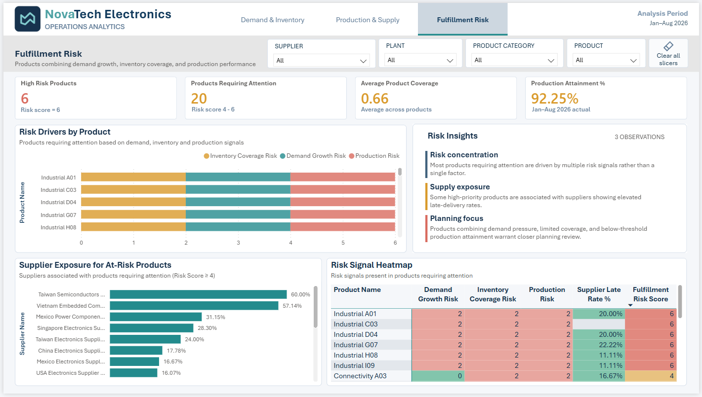

# Manufacturing Operations & Demand Planning Analytics

**NovaTech Electronics — Proyecto de portafolio | PostgreSQL · SQL · Power BI · DAX**




---

## 📌 Descripción del proyecto

Este proyecto simula el trabajo de un **Data Analyst** dentro de una empresa manufacturera ficticia llamada **NovaTech Electronics**, ubicada en Guadalajara, Jalisco.

El objetivo es responder una pregunta de negocio real:

> **¿Dónde está el mayor riesgo operativo, por qué está ocurriendo y qué debería priorizar el equipo de planeación?**

Para responderla, se construyó un flujo analítico completo:




> **Nota:** NovaTech Electronics es una empresa ficticia. Los datos son sintéticos y fueron diseñados para representar problemas operativos reales. No representan a Flex, Jabil, PiSA ni a ninguna empresa real.

---

## 🏢 Contexto de negocio

NovaTech Electronics es una empresa de manufactura electrónica (EMS) que fabrica componentes para clientes industriales, automotrices, médicos y de consumo.

Su flujo operativo es:

Demanda del cliente
↓
Planeación de demanda
↓
Inventario y disponibilidad de materiales
↓
Compras
↓
Entrega de proveedores
↓
Producción
↓
Producto terminado
↓
Cumplimiento del pedido


**El problema:** La empresa tiene dificultades para equilibrar demanda, inventario, abastecimiento y producción. Algunos productos tienen riesgo de stockout, otros tienen exceso de inventario, algunos proveedores entregan tarde y ciertas órdenes de producción no alcanzan lo planeado.

**La decisión que debe apoyar el análisis:** ¿Qué productos y situaciones de abastecimiento deberían recibir prioridad para proteger el cumplimiento de la demanda?

---

## ❓ Preguntas de negocio

El proyecto responde 15 preguntas agrupadas en 5 bloques:

| Bloque | Preguntas |
| :--- | :--- |
| **Demanda** | ¿Cómo evoluciona la demanda? ¿Qué productos están creciendo? ¿Qué productos requieren atención? |
| **Inventario** | ¿Qué productos tienen suficiente inventario? ¿Cuáles tienen riesgo de stockout? ¿Dónde hay exceso? |
| **Abastecimiento** | ¿Qué proveedores tienen peor desempeño? ¿Qué productos dependen de proveedores riesgosos? ¿Qué órdenes están retrasadas? |
| **Producción** | ¿Estamos produciendo suficiente? ¿Qué plantas tienen peor desempeño? ¿Qué productos combinan múltiples problemas? |
| **Priorización** | ¿Cuáles son los mayores riesgos? ¿Qué factores se repiten? ¿Dónde debe enfocarse planeación? |

---

## 🗂️ Datos

Se generaron **8 datasets sintéticos** que simulan un ERP, un MES y un sistema de planeación de demanda:

| Archivo | Granularidad | Descripción |
| :--- | :--- | :--- |
| `raw_products.csv` | 1 fila = 1 producto | Maestro de productos |
| `raw_suppliers.csv` | 1 fila = 1 proveedor | Maestro de proveedores |
| `raw_plants.csv` | 1 fila = 1 planta | Maestro de plantas |
| `raw_work_centers.csv` | 1 fila = 1 work center | Líneas de producción |
| `raw_demand.csv` | Producto + fecha + tipo | Demanda histórica y forecast |
| `raw_inventory.csv` | Producto + planta + fecha | Snapshots de inventario |
| `raw_purchase_orders.csv` | Línea de PO | Órdenes de compra |
| `raw_production_orders.csv` | Orden de producción | Producción planeada vs. real |

**Período:** Enero 2025 – Diciembre 2026  
**Semilla aleatoria:** 42 (reproducible)  
**Registros:** ~50K en total

### Problemas de calidad de datos incluidos

Para simular un entorno real, los datos raw incluyen:

- Espacios al final en códigos (`"P-1001 "`).
- Diferencias de capitalización en estatus (`"Received"`, `"RECEIVED"`).
- Algunos duplicados controlados.
- Valores nulos razonables (`receipt_date` vacío para PO abiertas).
- Errores de referencia controlados (`product_code` que no existe en el maestro).

Estos problemas se documentan y se tratan en la capa de staging.

---

## 🧱 Modelo de datos



El modelo final es un **esquema en estrella** con 5 dimensiones y 4 tablas de hechos:

### Dimensiones
- `dim_product`
- `dim_supplier`
- `dim_plant`
- `dim_work_center`
- `dim_date`

### Tablas de hechos
- `fact_demand` — granularidad: producto + planta + fecha + tipo
- `fact_inventory` — granularidad: producto + planta + snapshot date
- `fact_purchase_orders` — granularidad: línea de PO
- `fact_production` — granularidad: orden de producción

### Decisión técnica clave

Las métricas derivadas (días de retraso, brecha de producción, cumplimiento) **no se almacenan** en las tablas de hechos. Se calculan en SQL y DAX. Esto mantiene el modelo limpio y demuestra que entiendo la diferencia entre datos fuente y métricas calculadas.

### Scripts SQL y DAX

Los scripts del proyecto están organizados así:

- `sql/01_create_raw_tables.sql` — Creación de las 8 tablas RAW.
- `sql/02_staging_transformations.sql` — Limpieza, normalización y validación.
- `sql/03_analytics_model.sql` — Construcción del modelo dimensional.
- `sql/04_business_analysis.sql` — Consultas de análisis y data quality.
- `dax/measures.dax` — Medidas DAX del dashboard.

Las métricas derivadas (días de retraso, brecha de producción, cumplimiento) se calculan en SQL y DAX, no se almacenan en las tablas de hechos.

**Ejemplo de medida DAX:**

```dax
Fulfillment Risk Score =
    VAR DemandRisk = IF([Demand Growth %] > 0.20, 2, 0)
    VAR InventoryRisk = IF([Inventory Coverage Months] < 0.50, 2, 0)
    VAR ProductionRisk = IF([Production Attainment %] < 0.90, 2, 0)
    RETURN DemandRisk + InventoryRisk + ProductionRisk
```

---

## 🔄 Flujo ETL




### Capas en PostgreSQL

| Capa | Propósito |
| :--- | :--- |
| `raw` | Datos crudos, tal como llegan del sistema fuente |
| `staging` | Limpieza, normalización, validación |
| `analytics` | Modelo dimensional final (dim + fact) |

### Transformaciones principales

- `TRIM()` en todos los campos de texto.
- Eliminación de duplicados con `ROW_NUMBER()`.
- Filtros de reglas de negocio (`demand_qty > 0`, `inventory_qty >= 0`).
- Validación de integridad referencial con `LEFT JOIN` + `IS NULL`.
- Generación de surrogate keys en dimensiones.

---

## 📊 Dashboard

El reporte en Power BI tiene **3 páginas**, cada una enfocada en una pregunta de negocio.

### Página 1 — Demand & Inventory


**Pregunta:** ¿Cómo está evolucionando la demanda y tenemos suficiente inventario?

**KPIs:**
- Actual Demand: 7M
- Demand Growth: 5.70%
- Average Inventory: 2.95K
- Production Attainment: 92.25%

**Visuales:**
- Tendencia mensual de demanda (línea).
- Demanda vs. cobertura de inventario (scatter con burbujas).
- Tabla de planeación por producto con risk score.
- Panel de insights automáticos.

---

### Página 2 — Production & Supply


**Pregunta:** ¿Qué factores operativos pueden estar limitando el cumplimiento?

**KPIs:**
- Planned Production: 3.65M
- Actual Production: 3.37M
- Production Attainment: 92.25%
- Supplier Late Rate: 18.94%

**Visuales:**
- Producción planeada vs. real (línea doble).
- Cumplimiento de producción por planta (barras).
- Tasa de retraso por proveedor (barras).
- Tabla de desempeño de proveedores.
- Panel de insights.

---

### Página 3 — Fulfillment Risk


**Pregunta:** ¿Dónde debería concentrarse primero el equipo de planeación?

**KPIs:**
- High Risk Products: 6
- Products Requiring Attention: 20
- Average Product Coverage: 0.66 months
- Production Attainment: 92.25%

**Visuales:**
- Drivers de riesgo por producto (barras apiladas).
- Exposición de proveedores en productos en riesgo.
- Heatmap de señales de riesgo.
- Panel de insights.


### Diseño y paleta de colores

El dashboard usa una paleta consistente para comunicar riesgo:

| Color | Hex | Significado |
| :--- | :--- | :--- |
| Rojo | `#D96B5F` | Riesgo crítico |
| Ámbar | `#D99A2B` | Requiere atención |
| Teal | `#238B8D` | Normal |
| Verde | `#2E8B57` | Positivo |

Los colores se aplican dinámicamente con medidas DAX (`Risk Color`, `Coverage Color`, `Production Attainment Color`, `Risk Score Color`), de modo que el dashboard responde automáticamente a los datos.

---

## ⚖️ Inventory Optimization: el "sweet spot"

Uno de los objetivos del análisis fue encontrar el **equilibrio entre cobertura de inventario y exceso**. No se trata de tener más inventario, sino de tener el inventario correcto.

Se usaron dos señales:
- **Inventory Coverage Months:** cuántos meses de demanda cubre el inventario actual.
- **Demand Growth %:** si la demanda está creciendo o no.

Con estas dos señales, cada producto se clasifica en cuatro cuadrantes:

| Clasificación | Demanda | Cobertura | Significado | Acción |
| :--- | :--- | :--- | :--- | :--- |
| **High Risk** | Creciendo | < 0.5 meses | Riesgo de stockout | Priorizar reabasto |
| **Watch** | Estable o creciendo | 0.5–1.0 meses | Requiere atención | Monitorear |
| **Sweet Spot** | Estable | 1–4 meses | Equilibrio | Mantener |
| **Overstock** | Baja o estable | > 4 meses | Capital inmovilizado | Reducir compras |

> Los umbrales (0.5, 1.0, 4.0) son **supuestos del escenario simulado**, no políticas reales de NovaTech.

---

## 🔍 Hallazgos principales

1. **6 productos en alto riesgo (score = 6):** combinan demanda creciente, baja cobertura de inventario y producción por debajo del objetivo.
2. **20 productos requieren atención (score 4–6):** no todos son críticos, pero deben monitorearse.
3. **Cobertura promedio de 0.66 meses:** el inventario actual no alcanza a cubrir un mes completo de demanda en promedio.
4. **Production attainment del 92.25%:** la producción está por debajo del objetivo del 90% en al menos una planta.
5. **Supplier late rate del 18.94%:** casi 1 de cada 5 órdenes de compra llega tarde.
6. **Proveedores críticos:** Taiwan Semico (60%) y Vietnam Embed (57.14%) tienen las tasas de retraso más altas.
7. **Riesgo concentrado:** la mayoría de los productos en riesgo combinan múltiples señales, no solo una.

---

## ✅ Recomendaciones

1. **Priorizar reabasto de los 6 productos en alto riesgo.**
2. **Escalar órdenes retrasadas de proveedores críticos (Taiwan Semico, Vietnam Embed).**
3. **Revisar brechas de producción en plantas con attainment < 90%.**
4. **Monitorear los 20 productos en estado "Watch" para evitar que escalen a alto riesgo.**
5. **Reducir compras de productos en Overstock para liberar capital.**
6. **Mantener el Sweet Spot en productos con cobertura entre 1 y 4 meses.**

---

## 🛠️ Tecnologías usadas

| Herramienta | Uso |
| :--- | :--- |
| **Python** | Generación de datos sintéticos |
| **PostgreSQL** | Almacenamiento y transformación |
| **SQL** | Limpieza, validación, análisis |
| **Power BI** | Modelado, dashboards, visualización |
| **DAX** | Medidas, KPIs, risk scoring |
| **Git/GitHub** | Control de versiones |

---

## 📁 Estructura del repositorio

```
manufacturing-operations-analytics/
│
├── README.md
├── data/
│   ├── raw/
│   └── analytics/
├── python/
│   └── generate_data.py
├── sql/
│   ├── 01_create_raw_tables.sql
│   ├── 02_staging_transformations.sql
│   ├── 03_analytics_model.sql
│   └── 04_business_analysis.sql
├── dax/
│   └── measures.dax
├── dashboard/
│   └── Manufacturing_Operations.pbix
├── images/
│   ├── page1_demand_inventory.png
│   ├── page2_production_supply.png
│   ├── page3_fulfillment_risk.png
│   └── data_model.png
└── docs/
    ├── business_case.md
    └── data_dictionary.md
```


---

## 🚀 ¿Qué haría después?

- Agregar un forecast de 3 meses con moving average.
- Incluir costos de inventario para medir el impacto financiero del overstock.
- Analizar lead time por proveedor con más detalle.
- Automatizar el refresh con Power BI Service.
- Integrar datos de calidad (defects, scrap) en una siguiente fase.

---

## 📬 Contacto

**Oscar Dávila**
- LinkedIn: [linkedin.com/in/oscar-davila-58662011b](https://www.linkedin.com/in/oscar-davila-58662011b/)
- GitHub: [github.com/oscardavila-data](https://github.com/oscardavila-data)
- Email: oscar.davilaenriquez@gmail.com

---

> **Nota:** Este proyecto es un escenario simulado con fines de portafolio. NovaTech Electronics es una empresa ficticia y los datos no representan a ninguna empresa real.
